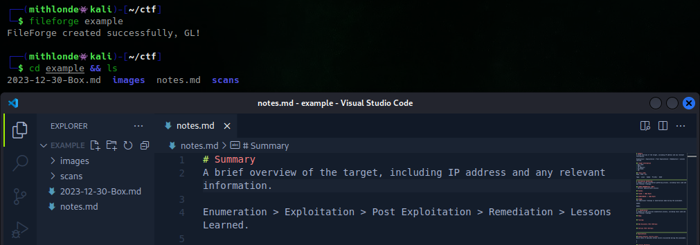

# FileForge
Automate setting up information gathering directories and sub-directories including files to be copied for pentest engagements.

A command-line tool to automate the process of creating new directories, copying files, and open everything in Visual Studio Code by default. Whether you're working on an actual pentest, doing a CTF on TryHackMe, HackTheBox, PG, or any other platform, FileForge simplifies the process so you can quickly jump into your engagement with everything you need at your fingertips.

To use FileForge, simply run the program with your desired hostname and any files you want to copy. You can also specify the code editor of your choice. And with the ability to add additional subdirectories and files, FileForge is fully customizable to suit your needs.



## Dependencies:
- **Python 3**: FileForge is a Python 3 script, so you'll need Python 3 installed on your system in order to run it.
- **Visual Studio Code**: While it's not strictly necessary, Visual Studio Code is the default text editor and may be useful for working with FileForge's code. If you plan to use it, make sure to download and install it from the official website.

## Installation:
To use fileforge.py, you can follow these steps:

1. Download the Python3 code from the GitHub repository, or use git to clone the repository to your local machine.
2. Open a terminal or command prompt and navigate to the directory where the fileforge.py script is located.
3. Run the script by typing `python3 fileforge.py` followed by the necessary command-line arguments, such as the directory name you wish to create.
4. The script will then automatically create the new directory, create the preferred sub directories, and copy all of the files specified in the code.

_Note that the script requires Python 3 to be installed on your system, as well as the os, shutil, subprocess, and argparse Python packages. These packages should be automatically installed when you run the script for the first time, but if you encounter any issues, you may need to manually install them using pip._

To add this tool to your bash aliases, you'll need to edit your bash profile file (usually located at ~/.bash_profile or ~/.bashrc) and add a new alias.

For example, if you want to call the tool by the name "fileforge" you can add the following line to your bash profile file:

```
alias fileforge='python3 /path/to/fileforge.py'
```
Make sure to replace "/path/to/fileforge.py" with the actual path of your fileforge script.

Once you've added the alias, you'll need to reload your bash profile file for the changes to take effect. You can do this by running the following command:

```
source ~/.bash_profile or source ~/.bashrc
```

After that, you should be able to use the "fileforge" command directly from the terminal.

## Usage
FileForge uses Python 3 specific functionality and does not support Python 2.
```
usage: FileForge [-h] [-e EDITOR] hostname [files_to_copy ...]

Automate setting up information gathering directories and subdirectories including files to be copied for pentest engagements.

positional arguments:
  hostname              Preferred hostname of directory
  files_to_copy         Files to be copied ["path/to/file1", "path/to/file2"]

options:
  -h, --help            show this help message and exit
  -e EDITOR, --editor EDITOR
                        code editor to open the directory (default: code)

Quick summary: FileForge can be used to automate setting up your information gathering archives. A task often repeated manually prior to any
pentest engagement. It will quickly create a new directory with the provided hostname, create sub-directories for images and scan results, and
copy files specified by the user (like your preferred note keeping template). Your FileForge will be opened in Visual Studio Code, ready set to
go start your engagement!
```

**Error Handling**:

There are a few different types of hostnames that could be considered "invalid" and handled as error cases in your program. Here are a few examples:

An empty hostname: If the user does not provide any input for the hostname when prompted, this is considered an invalid hostname and will be handled as an error case.

A hostname that contains invalid characters: If the user provides a hostname that contains characters that are not allowed in a hostname, such as special characters or spaces, this is considered an invalid hostname and will be handled as an error case.

## Changes Made
- January 16, 2023:
    - Initial version of the program created.
- January 17, 2023: 
    - Added support for copying multiple files using the `shutil.copy()` method in a for loop.
    - Added support for specifying the file path using the `--file_path` or `-f` option.
    - Added support for specifying the code editor using the `--editor` or `-e` option.
    - Added error handling for invalid hostname and incorrect file path.
- January 18, 2023:
    - Added option to copy multiple files, updated -h summary and README.
- January 22, 2023:
    - Added error case handling via invalid chars.
- January 23, 2023: 
    - Rewrote program to be well-structured and easy to understand.
    - Debugged editor option: added if/else functionality to have -e EDITOR open files_to_copy.
    - Redirect the -e EDITOR output to /dev/null, detaching it from the terminal and continue running in the background after the script exits.
- April 12, 2023:
    - Took out misconfigured code to allow FileForge to open the complete directory created via `os.mkdir(hostname)` on line 34 (V1.0.3).

## To-Do List
- [x] Add how to add multiple files to script
- [x] Adjust FileForge to only open 1 window (notekeeping template) when multiple files are copied
- [x] Update summary
- [x] Explain how to use the tool via bash aliases
- [x] Remove error case that states hostname can not contain "" (underscore)
- [x] Debug editor option, alternative editors not able to open hostname directory. Perhaps have it open files_to_copy only
- [x] Debugging the above now created the issue that default EDITOR (Visual Studio Code) is no longer opening directory either*
*Issue is the os.chdir(hostname) function changes the current working directory of the script, but it does not change the working directory of the terminal.

-- SOLVED BY TAKING OUT (V1.0.2):
```python3
39         host_path = os.path.abspath(hostname)
```

Also took out the function where it looks whether the editor specified is installed on the system.
```python3
58         editor_path = shutil.which(editor)
59
60         if editor_path:
61            subprocess.Popen([editor_path] + files_to_copy,
62                start_new_session=True, 
63                stdout=subprocess.DEVNULL,
64                stderr=subprocess.DEVNULL)
65        
66         else:
67            subprocess.run([editor], host_path)
```

- [ ] Debug editor of choice option with the `-e` flag. Note that FileForge is running Visual Studio Code by default. Others will not work sufficiently.
- [ ] Add `--flatten` option to copy all of the files directly into the target directory without creating a new folder.
